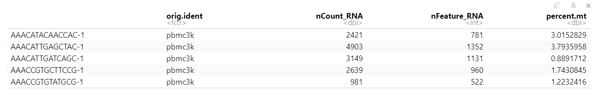

# Single-cell
## Setup data
### Barcodes.tsv.gz, features.tsv.gz, matrix.mtx.gz
1.Barcodes.tsv.gz: cell label(colnames) 
2.Features.tsv.gz: gene id(rownames=umi) 
3.Matrix.mtx.gz: expression data.

These three files are generated by cellranger, which is used to align reads and generate feature-barcode matrices
```{r}
library(dplyr)
library(Seurat)
library(patchwork)
# Load the PBMC dataset, seurat uses a sparse-matrix to save memory and enhance speed.（object.size）
count <- Read10X(data.dir = "./exampledata/")
# Initialize the Seurat object with the raw (non-normalized data).
pbmc <-
  CreateSeuratObject(
    counts = count,
    project = "pbmc3k",
    min.cells = 0,
    min.features = 0
  )
```
### Count file
```{r}
scRNA <- CreateSeuratObject(counts = counts)
```
### H5 file
H5 is a data file saved in the Hierarchical Data Format (HDF). It contains multidimensional arrays of data.
```{r}
sce <- Read10X_h5(filename = xxx_matrices_h5.h5")
sce <- CreateSeuratObject(counts = sce)
```
### H5ad file
1.convert h5ad to h5seurat
2.load seurat object by "loadh5seurat" function
```{r}
library(SeuratDisk)
Convert("xxx_raw_counts.h5ad", "h5seurat",
        overwrite = TRUE,assay = "RNA")
scRNA <- LoadH5Seurat("GSE153643_RAW/GSM4648565_liver_raw_counts.h5seurat")
```

## Standard pre-processing workflow(https://satijalab.org/seurat/articles/pbmc3k_tutorial.html)
GOAL:  To ensure that only single, live cells are included in downstream analysis(doi: 10.1186/s13059-016-0888-1)

orig.ident: number of cells in each sample(automatically set to active ident)(barcode)

nCount_RNA: number of count(UMI) in each cell

nFeature_RNA: number of genes in each cell

### QC and selecting cells for further analysis
#### Detecting the number of genes and counts in each cells
Low-quality cells or empty droplets often have very few genes

Cell doublets or multiplets may exhibit an aberrantly high gene count
(Doublets: a droplet in droplet-based sequencing that has captured atleast 2 cells. Multipletsmixing: this sample with other labeled samples)

These numbers of unique genes and total molecules(umi/count) were automatically calculated during `CreateSeuratObject()` and stored in metadata.

The cutoff of nFeature_RNA and nCount_RNA depend on vlnPlot.(https://hbctraining.github.io/scRNA-seq/lessons/04_SC_quality_control.html)??

#### Detecting the percentage of mitochondrial genome in all genome

Low-quality / dying cells often exhibit extensive mitochondrial contamination or a higher percentage of counts of mitochondrial genes. This is because some RNA in nucleus flow out through cell membrane due to changes in permeability when cell dies. However, RNA in mitochondria is fixed in mitochondria, and thus the ratio of RNA in mitochondria increases.
Thus, we should set a cutoff of percent.mt depends on distinctive tissues and cell situations. For example, the cutoff for tumors is 5, and the cutoff for liver and heart is 80 and 60 as there are more mitochondria in heart.

Using `PercentageFeatureSet()` function to calculate the percentage of mitochondrial gene in cell, which be able to identify dying cells or low- quality cells.

(The column sum of the counts for features belonging to the set / The column sum for all features))*100  
(https://www.rdocumentation.org/packages/Seurat/versions/3.1.3/topics/PercentageFeatureSet)
```{r mito}
# The [[ operator can add columns to object metadata. This is a great place to stash QC stats
pbmc[["percent.mt"]] <- PercentageFeatureSet(pbmc, pattern = "^MT-")
```

#### Visualizing QC metrics and filtering cells

```{r qc2, fig.height=7, fig.width=13}
#Visualize QC metrics as a violin plot
VlnPlot(pbmc, features = c("nFeature_RNA", "nCount_RNA", "percent.mt"), ncol = 3)
# FeatureScatter is typically used to visualize feature-feature relationships, but can be used for anything calculated by the object, i.e. columns in object metadata, PC scores etc.(pearson correlation)(https://satijalab.org/seurat/reference/featurescatter)
plot1 <- FeatureScatter(pbmc, feature1 = "nCount_RNA", feature2 = "percent.mt") 
plot2 <- FeatureScatter(pbmc, feature1 = "nCount_RNA", feature2 = "nFeature_RNA") 
plot1 + plot2
pbmc <- subset(pbmc, subset = nFeature_RNA > 200 & nFeature_RNA < 2500 & percent.mt < 5)
```
## Normalizing the data
GOALS：To remove the non-biological variation as much as possible, e.g. low input material and various forms of bias or noise present in the sequencing process(https://doi.org/10.3389/fgene.2020.00041)
